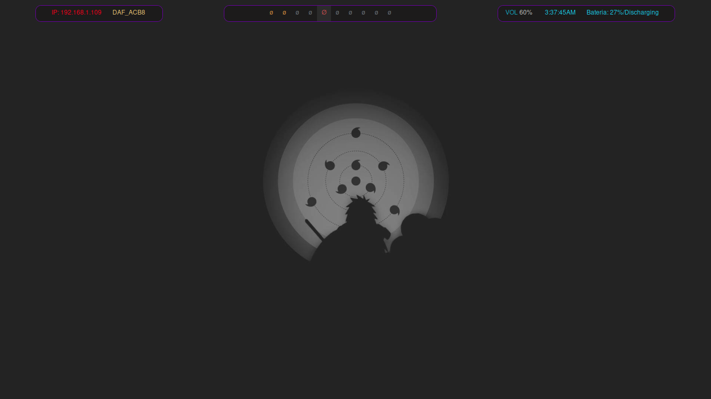
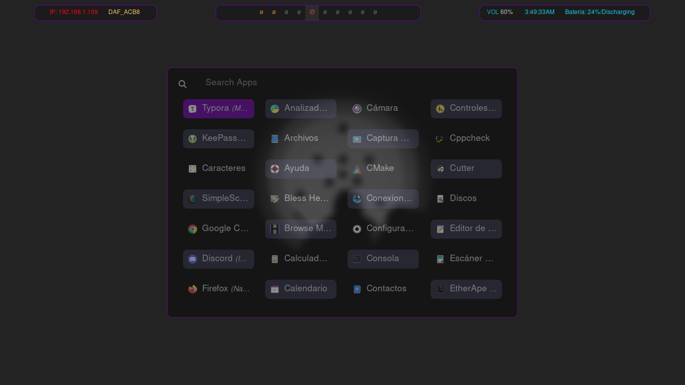
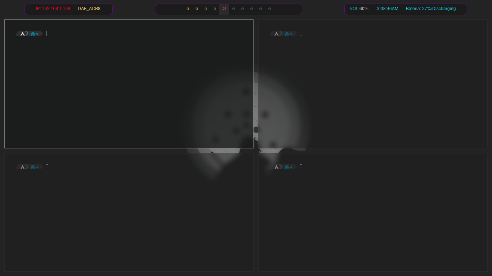

# BSPWM dotfiles for ArchLinux

In order for your environment to remain the same, it is necessary to download the "HackNerdFont" font at this [link](https://github.com/ryanoasis/nerd-fonts/releases/download/v3.3.0/Hack.zip). Additionally, you must download the following packages:

```bash
pacman -S bspwm rofi dunst picom polybar sxhkd zsh-autosuggestions zsh-syntax-highlighting 
```


# Screenshots:


#### Desktop



### Rofi



### Kitty




Probably in the future I will make an automatic installer...
